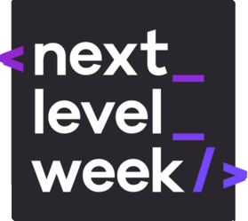

# NLW-1

Repositório das atividades desenvolvidas durante o 1º Next Level Week da RocketSeat.

Todos os códigos e atividades aqui presentes foram feitas durante a semana, com um toque pessoal para dar minha cara ao projeto.

## Sobre a aplicação

A aplicação se chama 'ecoleta', e conecta pessoas à entidades coletoras de resíduos de diversas origens.

A interface WEB será usada pelas entidades para cadastrar locais de coleta dos resíduos, onde é possível colocar imagens e texto de descrição do local, além de Endereço do local através de integração com o serviço do Google Maps.

A aplicação mobile será onde o usuário poderá visualizar locais de coleta de resíduos próximos a ele. Podendo filtrar o resultado por tipo de resíduo. Além disso, o usuário poderá consultar as informações de coleta e fazer contato através de e-mail ou Whatsapp (usando o recurso Deep Linkin).
